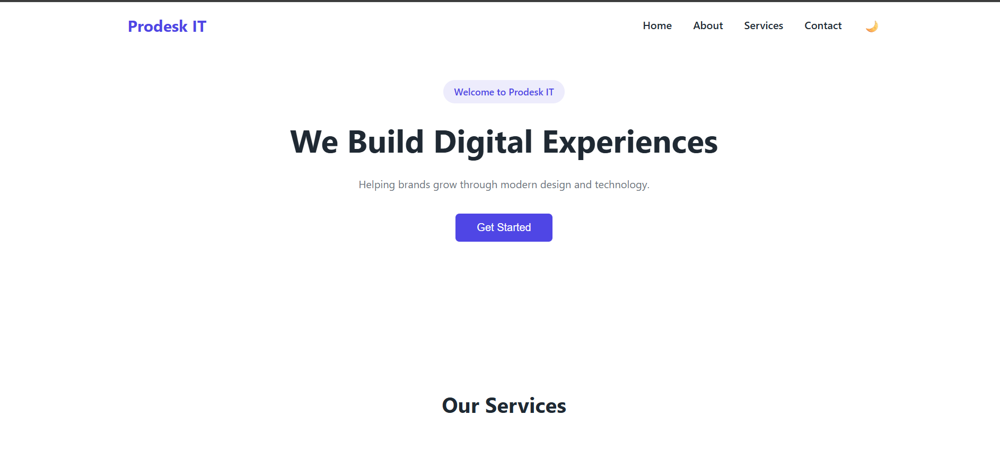

## Project Preview

\# Prodesk IT – Digital Agency Landing Page

\## Intern Details

\- \*\*Name:\*\* Krishna Kumar  

\- \*\*Role:\*\* Frontend Developer Intern  

\- \*\*Company:\*\* Prodesk IT  

\- \*\*Week:\*\* 1  

\- \*\*Level:\*\* Level 2 (Intermediate)

---

\## Project Overview

This project is a \*\*responsive digital agency landing page\*\* created as part of \*\*Week 1\*\* of the Prodesk IT Internship.  

The goal was to strengthen core frontend skills using \*\*raw HTML, CSS, and JavaScript\*\*, without any frameworks.

---

\## Tech Stack

\- HTML5 (Semantic structure)

\- CSS3 (Flexbox, Grid, Media Queries)

\- JavaScript (DOM manipulation)

\- Git \& GitHub

---

\## Features Implemented

\### Level 1

\- Responsive navbar

\- Hero section with CTA

\- Services section using CSS Grid

\- About and Contact sections

\- Footer

\### Level 2

\- Sticky navbar

\- Dark mode toggle (class-based)

\- Hover micro-interactions

\- Mobile responsiveness using media queries

---

\## Dark Mode

Dark mode is implemented by toggling a `dark-mode` class on the `<body>` using JavaScript.  

All styling changes are handled through CSS, keeping logic clean and scalable.

---

\## Project Structure

prodesk-week-1-digital-agency/

├── index.html

├── style.css

├── script.js

├── assets/

├── README.md

└── Prompts.md

---

\## How to Run

1\. Open the project folder in VS Code  

2\. Open `index.html` using \*\*Live Server\*\*  

3\. View the site in the browser  

4\. Use the 🌙 button to toggle dark mode  

---

\## Learning Outcomes

\- Understanding of semantic HTML

\- Hands-on experience with Flexbox \& Grid

\- Responsive design using media queries

\- Debugging frontend issues

\- Clean Git workflow

---

\## Demo Video

A short demo video explaining the project features and code structure  

\*(Link provided in the submission form)\*

---

\## Status

✔ Week 1 task completed  

✔ Level 2 requirements satisfied  

✔ Ready for review

